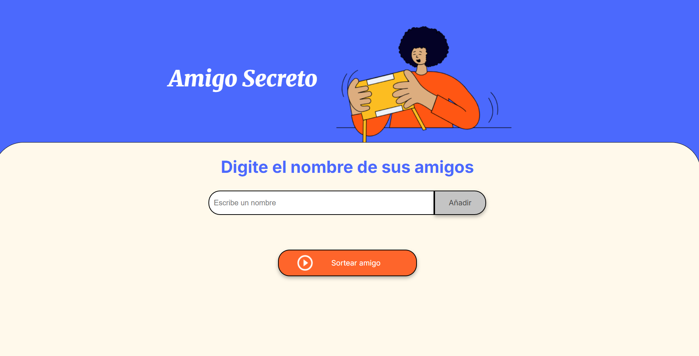

# 🎅 Amigo Secreto (Secret Santa)

Una aplicación web interactiva para realizar sorteos de "Amigo Secreto" de manera fácil y divertida. Agrega los nombres de los participantes y deja que la aplicación elija al azar quién le tocará hacer un regalo a quién.

## 🚀 Características

- ✅ Interfaz intuitiva y fácil de usar
- ✅ Validación de entrada para asegurar que solo se ingresen nombres válidos
- ✅ Capacidad para agregar múltiples nombres
- ✅ Botón para eliminar participantes individualmente
- ✅ Sorteo aleatorio con animación
- ✅ Diseño responsivo que funciona en dispositivos móviles y de escritorio
- ✅ Sin dependencias externas, solo JavaScript puro

## 🖥️ Cómo usar

1. Ingresa el nombre de un participante en el campo de texto
2. Haz clic en "Añadir" o presiona Enter
3. Repite el proceso para agregar más participantes
4. Haz clic en "Sortear amigo" para seleccionar un ganador al azar
5. ¡Listo! El nombre del ganador se mostrará en pantalla

## 🛠️ Instalación

No se requiere instalación. Simplemente abre el archivo `index.html` en tu navegador web favorito.

## 📸 Capturas de pantalla

*Interfaz principal de la aplicación*

*Ejemplo de sorteo realizado*

## 📝 Notas adicionales

- Los nombres solo pueden contener letras y espacios
- No se permiten números ni caracteres especiales
- La aplicación es completamente cliente, no se envían datos a ningún servidor

## 🎯 Tecnologías utilizadas

- HTML5
- CSS3 (Flexbox, Animaciones)
- JavaScript Vanilla (ES6+)

## 📄 Licencia

Este proyecto está bajo la Licencia MIT. Consulta el archivo [LICENSE](LICENSE) para más información.

---

Desarrollado por Lindbergh como parte del desafío de Alura LATAM
